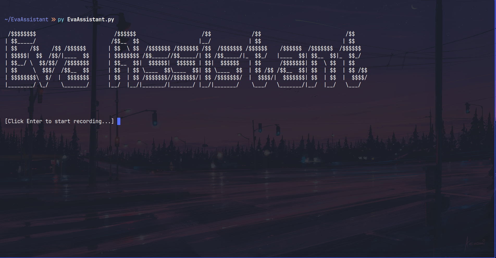

## 🧠 Eva is a private and offline AI assistant with no cloud, no tracking, and completely private on your Linux laptop.
---

---

## ✨ Features
- Voice-controlled commands (search, system info, media, etc.)
- Fully offline and privacy-respecting
- Interacts with your system: lock screen, show date/time, etc.
- Control music using `mpc/mpd`
- Lightweight and open-source
- Easily extensible with custom commands
---
## 📥 Installation
```bash
git clone https://github.com/VexilonHacker/EvaAssistant && cd EvaAssistant
```

- for __[uv](https://docs.astral.sh/uv/)__ manager "which can be up to 10x faster than pip" : 
    ```bash
    uv sync
    source .venv/bin/activate
    ```
- for pip manager :
    ```bash
    python -m venv .venv
    source .venv/bin/activate
    pip install -r requirements.txt
    ```
- system requirements:
    - Ollama (for running local LLMs):
    ```bash
    sudo pacman -S ollama # for arch based distros
    curl -fsSL https://ollama.com/install.sh | sh  # for other linux distros

    ```
    - then run and checkout [Ollama Benchmarks Results](Benchmarks/ollama_benchmark_results.txt):
    ```bash
        ollama pull tinydolphin
        ollama pull gurubot/phi3-mini-abliterated 
        ollama pull huihui_ai/phi4-mini-abliterated 
        ollama pull gemma3 
        # for models that have been tested 
        """
        tinydolphin: very fast response but less accurate
        gurubot/phi3-mini-abliterated: medium speed but accurate + uncensored 
        huihui_ai/phi4-mini-abliterated: medium speed and accurate but best of all + uncensored (Default)
        gemma3: Slow but provides more accurate responses
        """
    ```
    - You can change the default model by editing the **model** variable in the **main** function in __[EvaAssistant.py](EvaAssistant.py)__
    ```python
    def main():
        global  assistant_name
        TestInputSound = False
        assistant_name = 'Eva'
        DisableErrorMsgs()
        # for models that have been tested 
        """
        tinydolphin: very fast response but less accurate
        gurubot/phi3-mini-abliterated: medium speed but accurate 
        huihui_ai/phi4-mini-abliterated: medium speed and accurate but best of all: uncensored (Default)
        gemma3: Slow but provide more accurate
        """
        # model = "gemma3"
        # model = "tinydolphin"
        model = "huihui_ai/phi4-mini-abliterated"
        output_wav = '.micro.wav'
        speech_wav = '.output.wav'
    ```

    - Physlock (for locking the screen):
    ```bash
    sudo apt install physlock # debian based distros
    sudo pacman -S physlock # for arch based distros
    ```
--- 
## 🧪 Test the Setup:
After starting __`EvaAssistant.py`__, try saying:
```text
Eva, explain quantum physics 
```
If Eva responds correctly, your setup is working!

---
## 🧩 General Voice Command 
- Open browser and search query:
    ```bash
    Eva, search for [query]
    ```
- Play/Pause music using (mpc/mpd):
    ```bash
     Eva, play music /  Eva, start music 
     Eva, stop music /  Eva, pause music
    ```

- Showing date and time using `date` command and `time` module:
    ```bash
     Eva, show me the date / Eva, what is todays date
     Eva, show me the time / Eva, what is the time now
    ```

- Showing calendar on cli using `cal` command:
    ```bash
     Eva show me the calendar
    ```
- Showing system information using `shell/sysfetch` bash script:
    ```bash
     Eva, show me the system info /  Eva, show me the system information 
    ```
- Locking computer until entering password using `physlock` command:
    ```bash
     Eva, lock my laptop / Eva, lock my pc
    ```

## 🧠 Extending Eva
You can define your own custom commands by editing `AI_RESPONSE()` function.

## 🔒 Privacy First

Eva is designed for **total offline use**. No voice data leaves your device and everything is processed locally, giving you full control.

---

## 📄 License

This project is licensed under the MIT License.

---

Developed by [VexilonHacker](https://github.com/VexilonHacker) 

